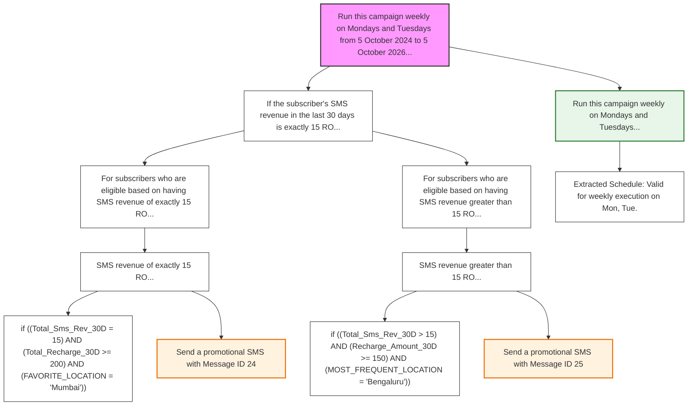

# Text to Rule Converter

Converts natural language telecom rules into structured JSON and logic.

## Workflow Visualization

```mermaid
graph TD
    VAL[Validation Agent] -->|Success| DEC[Decomposition Agent]
    DEC -->|Success| CON_DEC[Consistency Check (Decomposition)]
    CON_DEC -->|Success| SCH[Schedule Extraction]
    SCH --> CON_EXT[Condition Extraction]
    CON_EXT --> CON_CHK[Consistency Check (Condition)]
    CON_CHK -->|Success| RULE[Rule Converter Agent]
    RULE --> UNI[Unified Rule Agent (KPI & IF)]
    UNI --> END((End))
```

## Example Output Tree (Unified Rule Agent)


